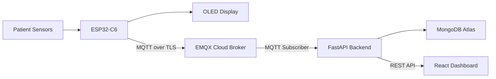

# Smart Ambulance

An IoT-based patient monitoring system designed for ambulances. The system collects patient vital signs using an ESP32-C6, securely publishes telemetry through MQTT over TLS, stores readings in MongoDB Atlas, and displays live data in a React dashboard.

## Features 

- Real-time heart-rate monitoring and SpO₂ estimation using MAX30102
- Temperature monitoring using DS18B20
- Raw ECG sampling using an AD8232 module
- SH1106 OLED display for local vital-sign visibility
- ESP32-C6 Wi-Fi connectivity
- Secure MQTT communication over TLS
- EMQX Cloud MQTT broker integration
- FastAPI backend with MQTT subscriber
- MongoDB Atlas storage
- React/Vite dashboard for live patient vitals
- Automatic sensor and MQTT reconnect handling

## Architecture



## System Flow

1. The ESP32-C6 reads values from the MAX30102, DS18B20, and ECG input.
2. Vital signs are displayed locally on the SH1106 OLED display.
3. The ESP32 publishes patient data to EMQX Cloud through MQTT over TLS.
4. The FastAPI backend subscribes to the MQTT topic.
5. Received payloads are saved in MongoDB Atlas with a UTC timestamp.
6. The React dashboard polls the backend every second and displays the newest patient reading.

## Tech Stack

| Layer | Technologies |
|---|---|
| Embedded firmware | ESP-IDF, C, FreeRTOS |
| Microcontroller | ESP32-C6 |
| MQTT broker | EMQX Cloud |
| Backend | Python, FastAPI, Paho MQTT |
| Database | MongoDB Atlas |
| Frontend | React, Vite |
| Display | SH1106 OLED |
| Sensors | MAX30102, DS18B20, AD8232 |

## Hardware Requirements

- ESP32-C6 DevKit / ESP32-C6 WROOM-1
- MAX30102 pulse-oximeter sensor
- DS18B20 temperature sensor
- AD8232 ECG sensor module
- SH1106 128×64 I2C OLED display
- Breadboard and jumper wires
- USB cable for ESP32-C6 programming

## Sensor Connections

| Module | ESP32-C6 Pin | Notes |
|---|---:|---|
| MAX30102 SDA | GPIO 6 | I2C data |
| MAX30102 SCL | GPIO 7 | I2C clock |
| SH1106 OLED SDA | GPIO 6 | Shares I2C bus with MAX30102 |
| SH1106 OLED SCL | GPIO 7 | Shares I2C bus with MAX30102 |
| DS18B20 Data | GPIO 4 | Use a pull-up resistor if required |
| AD8232 Output | GPIO 0 | ADC1 Channel 0 |
| ESP32-C6 | USB | Programming and serial monitor |

## Repository Structure

```text
Smart-Ambulance/
├── backend/
│   ├── api/
│   │   └── routes.py              # FastAPI API routes
│   ├── app.py                     # FastAPI application entry point
│   ├── config.py                  # Environment configuration loader
│   ├── database.py                # MongoDB connection
│   ├── mqtt_client.py             # MQTT subscriber and MongoDB writer
│   ├── requirements.txt           # Python dependencies
│   └── test_db.py                 # MongoDB connection test
│
├── firmware/
│   ├── main/
│   │   ├── native_main.c          # Firmware entry point
│   │   ├── native_wifi.c          # Wi-Fi connection logic
│   │   ├── native_mqtt.c          # MQTT/TLS publishing logic
│   │   ├── health_monitor.c       # Sensor acquisition and calculations
│   │   ├── health_monitor.h       # Vital-sign data structure
│   │   ├── oled_display.c         # SH1106 OLED display driver
│   │   ├── oled_display.h
│   │   ├── configuration.h         # Wi-Fi/MQTT configuration
│   │   └── certificates.h          # MQTT CA certificate (local only)
│   ├── CMakeLists.txt
│   └── sdkconfig.defaults
│
├── frontend/
│   ├── src/
│   │   ├── App.jsx                # Dashboard interface
│   │   ├── App.css
│   │   ├── index.css
│   │   └── main.jsx
│   ├── package.json
│   └── vite.config.js
│
└── README.md
```

## MQTT Telemetry

The ESP32 publishes vitals to:

```text
smartambulance/ambulance001/vitals
```

Example payload:

```json
{
  "patientId": "P001",
  "ambulanceId": "AMB001",
  "heartRate": 78.5,
  "spo2": 97.2,
  "temperature": 36.8
}
```

## Firmware Setup

### Prerequisites

- Visual Studio Code
- ESP-IDF extension for VS Code
- ESP-IDF v6.x
- ESP32-C6 board connected through USB
- EMQX Cloud account and MQTT deployment
- MQTT broker CA certificate

### Configure Wi-Fi and MQTT

Create or update:

```text
firmware/main/configuration.h
```

Example:

```c
#pragma once

#define WIFI_SSID "YOUR_WIFI_NAME"
#define WIFI_PASSWORD "YOUR_WIFI_PASSWORD"

#define MQTT_BROKER "YOUR_EMQX_HOST"
#define MQTT_PORT 8883

#define MQTT_USERNAME "YOUR_MQTT_USERNAME"
#define MQTT_PASSWORD "YOUR_MQTT_PASSWORD"

#define CLIENT_ID "AMBULANCE001"

#define TOPIC_VITALS "smartambulance/ambulance001/vitals"
#define TOPIC_GPS "smartambulance/ambulance001/gps"
#define TOPIC_ECG "smartambulance/ambulance001/ecg"
#define TOPIC_TRAFFIC "smartambulance/ambulance001/traffic"
#define TOPIC_ALERTS "smartambulance/ambulance001/alerts"
#define TOPIC_PREDICTION "smartambulance/ambulance001/prediction"
```

### Configure the MQTT Certificate

Create this local file:

```text
firmware/main/certificates.h
```

Then add the CA certificate provided by EMQX Cloud:

```c
#pragma once

static const char *ROOT_CA =
"-----BEGIN CERTIFICATE-----\n"
"YOUR_CA_CERTIFICATE_CONTENT\n"
"-----END CERTIFICATE-----\n";
```

### Build, Flash, and Monitor

Open an ESP-IDF terminal inside the `firmware` folder:

```powershell
idf.py set-target esp32c6
idf.py build
idf.py -p COM12 flash monitor
```

Replace `COM12` with the serial port assigned to your ESP32-C6.

Expected serial output includes messages similar to:

```text
Connected; IP=...
Connected to MQTT broker
Published message id=...
Vitals: HR=... bpm, SpO2=... %, Temp=... C
```

## Backend Setup

### Prerequisites

- Python 3.10 or newer
- MongoDB Atlas cluster
- EMQX Cloud MQTT deployment
- MQTT CA certificate

### Create Environment File

Create `backend/.env`:

```dotenv
MQTT_BROKER=your-emqx-host
MQTT_PORT=8883
MQTT_USERNAME=your-mqtt-username
MQTT_PASSWORD=your-mqtt-password
TOPIC_VITALS=smartambulance/ambulance001/vitals
CLIENT_ID=backend-subscriber-id
MONGODB_URI=your-mongodb-atlas-connection-string
```

Place your MQTT CA certificate here:

```text
backend/emqx-ca.crt
```

### Install and Run

```powershell
cd backend
python -m venv .venv
.\.venv\Scripts\Activate.ps1
pip install -r requirements.txt
pip install pymongo python-dotenv
uvicorn app:app --reload
```

The backend runs at:

```text
http://127.0.0.1:8000
```

Interactive API documentation is available at:

```text
http://127.0.0.1:8000/docs
```

## API Endpoints

| Method | Endpoint | Description |
|---|---|---|
| `GET` | `/` | Backend status message |
| `GET` | `/patients/{patient_id}/latest` | Latest stored vitals for a patient |
| `GET` | `/patients/{patient_id}/history` | Ten most recent readings for a patient |

Example:

```text
GET http://127.0.0.1:8000/patients/P001/latest
```

## Frontend Setup

### Prerequisites

- Node.js 18 or newer
- npm

### Install and Run

```powershell
cd frontend
npm install
npm run dev
```

Open the Vite URL shown in the terminal, normally:

```text
http://localhost:5173
```

The dashboard currently requests live data for patient ID `P001` from:

```text
http://127.0.0.1:8000/patients/P001/latest
```

## Running the Full System

Start the components in this order:

1. Start MongoDB Atlas and confirm the connection string is valid.
2. Start the FastAPI backend.
3. Start the React dashboard.
4. Flash and monitor the ESP32-C6 firmware.
5. Place a finger on the MAX30102 sensor.
6. Verify readings on the OLED display, serial monitor, MongoDB collection, and dashboard.

## Current Status

- [x] ESP32-C6 Wi-Fi connectivity
- [x] MQTT over TLS communication
- [x] EMQX Cloud integration
- [x] MAX30102 heart-rate and SpO₂ estimation
- [x] DS18B20 temperature reading
- [x] AD8232 raw ECG sampling
- [x] SH1106 OLED display
- [x] FastAPI MQTT subscriber
- [x] MongoDB Atlas storage
- [x] React live-vitals dashboard
- [ ] GPS tracking
- [ ] Hospital and doctor alert workflow
- [ ] Patient risk prediction model
- [ ] Historical charts in dashboard
- [ ] Authentication and role-based access
- [ ] Production deployment

## Security Notes

Do not commit any of these files or secrets to GitHub:

```text
backend/.env
backend/emqx-ca.crt
firmware/main/configuration.h
firmware/main/certificates.h
```

Recommended `.gitignore` entries:

```gitignore
# Python
backend/.venv/
backend/__pycache__/
*.pyc

# Node
frontend/node_modules/
frontend/dist/

# Secrets
backend/.env
backend/*.crt
firmware/main/configuration.h
firmware/main/certificates.h

# ESP-IDF
firmware/build/
firmware/sdkconfig
```

If credentials, Wi-Fi passwords, broker details, or certificates were ever uploaded to a public repository, rotate them immediately.

## Future Improvements

- Add GPS location using NEO-8M
- Stream ECG data to the backend
- Add real-time WebSocket updates instead of polling
- Add charts for heart rate, SpO₂, and temperature trends
- Add emergency threshold alerts
- Integrate ML-based patient risk prediction
- Add hospital-side monitoring portal
- Add user authentication and access control
- Containerize backend and frontend deployment